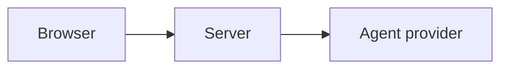

# Markdown diagrams

T3 Code renders Mermaid diagrams in browser and desktop conversations, proposed plans,
pull-request text, and Markdown file previews. Put the Mermaid source in a fenced code block:

````markdown

````

Use the diagram toolbar to view or copy its source. While an agent is still writing a message, T3
Code shows the fence as code and renders it after the message finishes. Invalid Mermaid source stays
visible with its render error.

Mobile clients currently show Mermaid fences as code.
